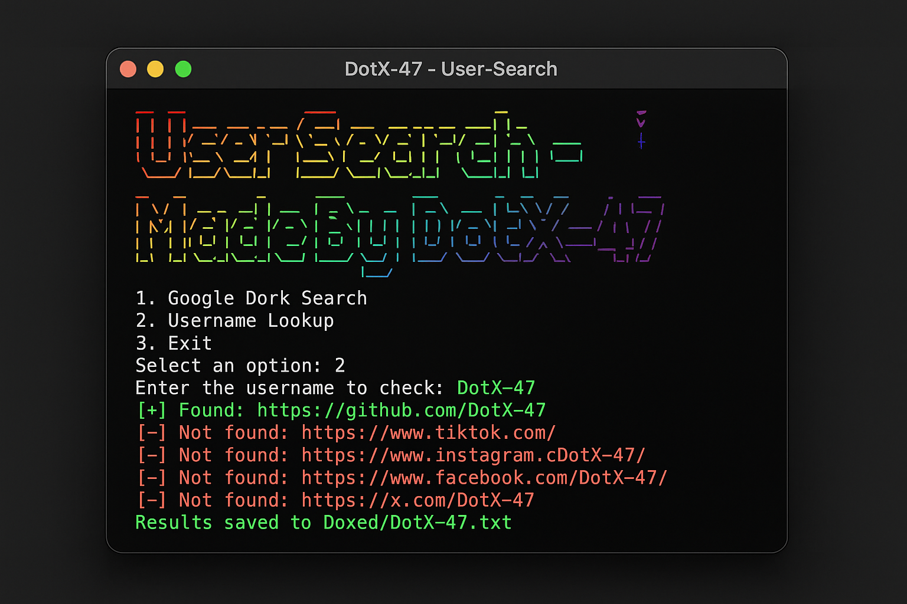

# 🕵️‍♂️ User-Search – Made By DotX-47

> A clean, fast, and colorful **OSINT** utility for enumerating usernames across many platforms.  
> Features an **animated rainbow ASCII banner**, concurrent lookups, Google dork search support, and automatic result saving.

---

## 🌈 Quick preview

When run, the tool shows an animated rainbow ASCII banner and a simple menu:

```
[ animated rainbow banner ]
[ MENU ]
1. Google Dork Search
2. Username Lookup
3. Exit
```

Example output after choosing "Username Lookup" for `DotX-47`:

```
Select an option: 2
Enter the username to check: DotX-47

[+] Found: https://github.com/DotX-47
[-] Not found: https://www.instagram.com/DotX-47/
[-] Not found: https://x.com/DotX-47
Results saved to Doxed/DotX-47.txt
```

---

## 🚀 Features

- 🔎 Username lookup across many popular platforms (25+)
- 🌐 Simple Google Dork scraping option
- ⚡ Multi-threaded checks (fast)
- 🌈 Animated rainbow ASCII banner at startup
- 💾 Automatically saves positive results in `Doxed/<username>.txt`
- ✨ Lightweight, terminal-first UX

---

## 🧩 Platforms checked (examples)

YouTube, TikTok, Instagram, Facebook, X (Twitter), GitHub, GitLab, Reddit, Steam, SoundCloud, Pastebin, Telegram, Keybase, Pinterest, Behance, Dribbble, DeviantArt, LinkedIn, Twitch, VK, OK.ru, and more.

> Note: exact coverage depends on the script version/URL list. Some services have numeric ID-based profiles or rate limits that require custom checks.

---

## ⚙️ Requirements

- Python 3.8+
- The following Python packages:

```
requests
beautifulsoup4
pyfiglet
colorama
```

**`requirements.txt` contents (paste into a file named `requirements.txt` if you want a file):**

```
requests>=2.28.0
beautifulsoup4>=4.12.0
pyfiglet>=0.8.post1
colorama>=0.4.6
```

You can install dependencies with:

```bash
pip install -r requirements.txt
```

or

```bash
pip install requests beautifulsoup4 pyfiglet colorama
```

---

## 🧭 Installation & Run

1. Clone this repository:

```bash
git clone https://github.com/yourusername/User-Search.git
cd User-Search
```

2. (Optional) Create and activate a virtual environment:

```bash
python3 -m venv venv
source venv/bin/activate   # Linux / macOS
venv\Scripts\activate      # Windows (PowerShell)
```

3. Install dependencies:

```bash
pip install -r requirements.txt
```

4. Run the tool:

```bash
python3 user_search.py
```

> If your terminal supports ANSI colors, you’ll see the animated rainbow banner. If you run into issues on Windows, use a modern terminal (Windows Terminal / PowerShell) or WSL.

---

## 🧠 Usage

The script is interactive. Choose from the menu:

1. **Google Dork Search** — enter a Google dork query string and the script will attempt to return search results (HTML scraping; may break if Google changes layout or blocks the request).
2. **Username Lookup** — enter a username string (e.g., `DotX-47`) and the tool will probe a curated list of profile URLs in parallel. Positive hits are shown and saved in the `Doxed/` directory.
3. **Exit** — quit the program.

### Example

```
1. Google Dork Search
2. Username Lookup
3. Exit
Select an option: 2
Enter the username to check: DotX-47
[+] Found: https://github.com/DotX-47
[-] Not found: https://www.instagram.com/DotX-47/
Results saved to Doxed/DotX-47.txt
```

---

## 📝 Saving & Output

- All **positive** findings are written to `Doxed/<username>.txt`.  
- Each saved file contains one discovered profile URL per line.

---

## ⚖️ Legal & Ethical Notice (READ THIS)

This tool is provided for **ethical** use cases such as:
- authorized penetration testing,
- personal account discovery,
- digital footprinting,
- red team exercises, and
- cybersecurity research.

**You must have explicit permission** to investigate a target.  
Do **NOT** use this tool for harassment, stalking, privacy invasion, or any illegal activity.

The author (DotX-47) assumes **no responsibility** for misuse. Use at your own risk.

---

## 🧾 Full MIT License (included)

```
MIT License

Copyright (c) 2025 DotX-47

Permission is hereby granted, free of charge, to any person obtaining a copy
of this software and associated documentation files (the "Software"), to deal
in the Software without restriction, including without limitation the rights
to use, copy, modify, merge, publish, distribute, sublicense, and/or sell
copies of the Software, and to permit persons to whom the Software is
furnished to do so, subject to the following conditions:

The above copyright notice and this permission notice shall be included in all
copies or substantial portions of the Software.

THE SOFTWARE IS PROVIDED "AS IS", WITHOUT WARRANTY OF ANY KIND, EXPRESS OR
IMPLIED, INCLUDING BUT NOT LIMITED TO THE WARRANTIES OF MERCHANTABILITY,
FITNESS FOR A PARTICULAR PURPOSE AND NONINFRINGEMENT. IN NO EVENT SHALL THE
AUTHORS OR COPYRIGHT HOLDERS BE LIABLE FOR ANY CLAIM, DAMAGES OR OTHER
LIABILITY, WHETHER IN AN ACTION OF CONTRACT, TORT OR OTHERWISE, ARISING FROM,
OUT OF OR IN CONNECTION WITH THE SOFTWARE OR THE USE OR OTHER DEALINGS IN THE
SOFTWARE.
```

---

## 🗂 Suggested repository layout

```
User-Search/
│
├── user_search.py        # main script (contains animated banner)
├── requirements.txt      # dependency list (optional, contents shown above)
├── README.md             # this file
└── assets/               # optional screenshots for the README
    ├── demo.png
    └── example_output.png
```

---

## ✉️ Contact / Author

**DotX-47** — Cybersecurity & OSINT Enthusiast  
Email: your_email@example.com

---

## ⭐ If you like this project
- Star the repo on GitHub
- Share with fellow OSINT/cybersec folks
- Suggest improvements via Issues / Pull Requests

---

_End of README — ready to copy into `README.md`._
